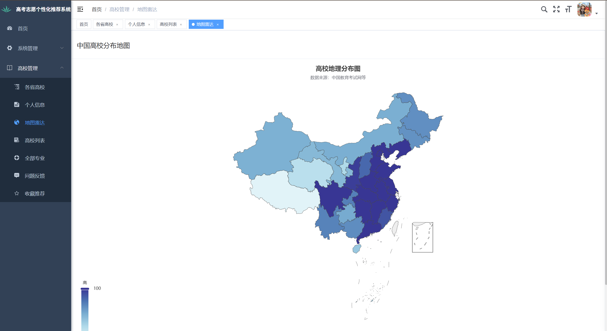
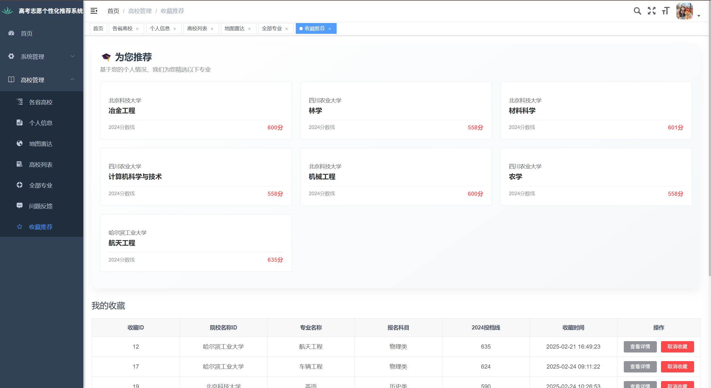

# 🎓 高考志愿智能推荐系统 | Smart Gaokao Advisor

基于 SpringBoot + Vue 的高考志愿智能推荐系统，为全国考生提供个性化、数据驱动的志愿填报辅助工具。结合高校录取线、985/211 分布、院校排名和专业前景等多维数据，帮助你做出更明智的选择！

> 📌 如果你觉得项目不错，欢迎点个 Star ⭐ 支持一下！

---

## 🔍 项目简介

本系统旨在为高考学生和家长提供一站式的志愿填报参考平台，支持交互式地图可视化、智能推荐、院校与专业查询等功能，解决填报志愿过程中的信息分散、决策困难等痛点。

---

## 🚀 技术架构

- **前端**：Vue 3 + ECharts + Element Plus
- **后端**：Spring Boot + MyBatis-Plus + MySQL
- **可视化**：中国地图热力图，展示高校资源分布
- **推荐算法**：基于分数线、地区、专业热度进行智能匹配（持续优化中）

---

## 🧩 核心功能

| 模块名称     | 描述                                                         |
|--------------|--------------------------------------------------------------|
| 🎓 地图可视化 | 展示全国各省 985/211 高校数量，支持分数线分布热力图        |
| 🏫 院校查询   | 按地区、类型、排名等维度查询全国高校信息                   |
| 📚 专业查询   | 查询专业就业方向、热度、所属学科门类                       |
| 💡 智能推荐   | 根据考生分数、科类、意向地区推荐匹配的大学和专业           |
| 📊 数据分析   | 支持历年最低投档线趋势图、专业热度分析图                  |
| 🛠️ 后台管理  | 支持高校、专业、分数线等数据的维护（管理员权限）          |

---

## 📸 系统截图

> 🚧 页面设计持续优化中，欢迎提交 PR 一起共建！

| 登录            | 注册          |
|----------------------|----------------------|
|  |  |
| 地图可视化            | 智能推荐页面          |
|||
|  |  |


---

## 📦 快速启动

```bash
# 克隆项目
git clone https://github.com/your-username/gaokao-advisor.git

# 导入后端 SpringBoot 项目，配置好数据库
# 导入前端 Vue 项目，运行 npm install & npm run dev
